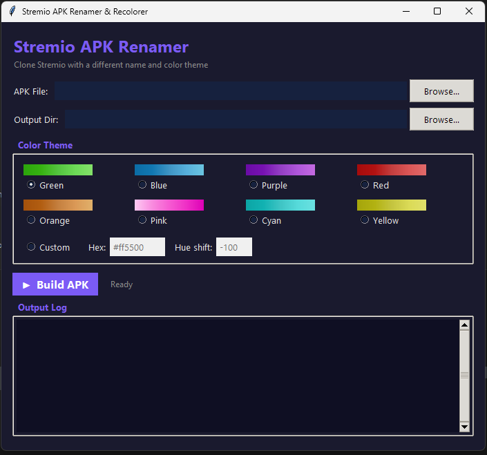
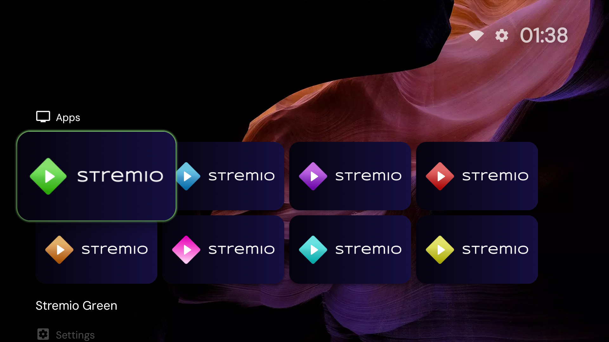
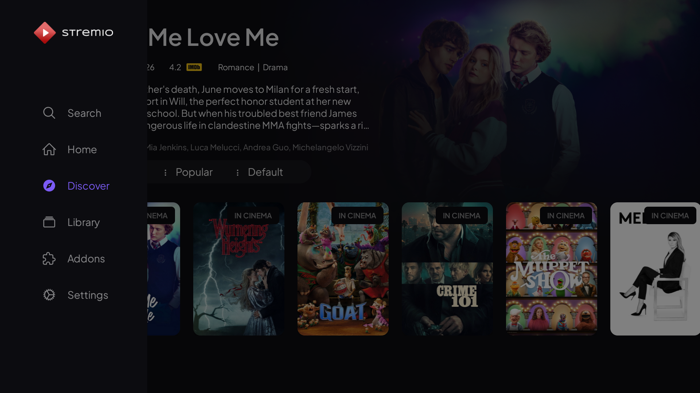
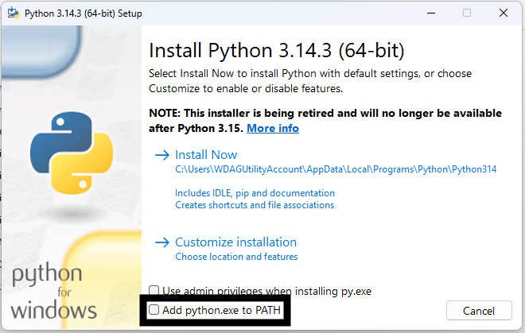

# Stremio Renamer

> A renamer and recolourer for 'Stremio', used for having multiple accounts on the same device.

<p align="center">
  <br>
  <sub>The GUI - select your APK and choose a colour theme</sub>
</p>

<p align="center">
  <br>
  <sub>Multiple renamed Stremio instances on your Android TV home screen</sub>
</p>

<p align="center">
  <br>
  <sub>Each instance runs independently with its own account</sub>
</p>

## Features

- **Different app names** - based on the colour theme you choose
- **Custom colours** - pick a preset theme or create your own
- **Automatic rebuild & signing** - outputs a ready-to-install APK
- **Works with any Stremio Android TV APK** (v1.9.5 and newer)

## Compatibility

- **OS Support**
  - 🟢 Windows 10 / 11 (Tested)
  - 🟡 macOS (Untested)
  - 🟡 Linux (Untested)

- **Stremio**
  - v1.9.5 → Latest (1.9.7 at the time of writing)

---

## Requirements

You need **three things** installed before using this tool:

### 1. Python 3.13 or newer

[**Download Python**](https://www.python.org/downloads/)

> **Important:** During installation, tick the box that says **"Add python.exe to PATH"** - this lets you run Python from any terminal.
>
> 

To check if Python is already installed, open **Command Prompt** or **PowerShell** and type:

```
python --version
```

If you see something like `Python 3.1x.x`, you're good to go. If you get an error, install it from the link above.

### 2. Java JDK

[**Download Java JDK**](https://adoptium.net/)

To check if Java is already installed, type:

```
java -version
```

If you see a version number, you're all set. If not, install it from the link above.

### 3. A Stremio Android TV APK

Download your own copy from [**stremio.com/downloads**](https://www.stremio.com/downloads). This tool does **not** include or distribute any APK files.

---

## Installation

1. **Download this project**
   - Click the green **<> Code** button at the top of this page → **Download ZIP**
   - Extract the ZIP somewhere you can find it (e.g. your Downloads folder)

2. **Open a terminal in the project folder**
   - On Windows, you can hold **Shift + Right-click** inside the folder and select **"Open PowerShell window here"**, or open a terminal and navigate manually:
   ```sh
   cd C:\Users\YourName\Downloads\stremio-renamer-main\stremio-renamer-main
   ```

3. **Install the required Python packages**
   ```sh
   pip install -r requirements.txt
   ```

Then you're ready to go!

---

## Usage

### GUI (Recommended)

The easiest way to use this tool is with the graphical interface:

```sh
python stremio_renamer_gui.py
```

1. **Select your APK** - browse to the Stremio APK you downloaded.
2. **Choose a colour** - pick a preset theme or enter a custom colour.
3. **Click "Build APK"** - wait for the process to finish, and your new APK will be created.

### Command Line

For advanced users, you can also run the tool directly from the terminal:

```sh
python stremio_renamer.py apk color [options]
```

| Argument | Required | Description |
|---|:---:|---|
| `apk` | Yes | Path to your Stremio APK file |
| `color` | Yes | Colour theme name |
| `-o OUTPUT` | No | Custom output file path |
| `--custom-color HEX` | No | Use a custom hex colour (e.g. `#FF5500`) |
| `--hue-shift VALUE` | No | Shift the hue by a specific amount |
| `--apktool PATH` | No | Path to a custom apktool |

---

## How It Works

1. The tool automatically downloads **APKTool** for you - no setup needed.
2. Your APK is unpacked, the colours and name are changed, and it's rebuilt.
3. The new APK is signed with a debug key so you can sideload it onto your device.

---

## Troubleshooting

| Problem | What to do |
|---|---|
| `python` or `java` is not recognised | Make sure Python and Java are installed **and added to your PATH** (see [Requirements](#requirements)) |
| The new APK won't install on my device | Enable **"Install from unknown sources"** in your device settings |
| The colours don't look right | Try a different hue shift value or a different base colour |
| Something else went wrong | Make sure you're using a **Stremio Android TV** APK - other APKs are not supported |

---

## Notes

- **You must provide your own APK.** This tool does not include or distribute Stremio.
- The output APK is signed with a debug key (not a release key).
- Only modify APKs you have the legal right to modify.
- `apksigner.jar` and `zipalign.exe` are bundled for convenience - they're needed to rebuild and sign the APK. You're welcome to substitute your own copies.

## Contributing

Pull requests and issues are welcome!

## License

See [LICENSE](LICENSE) for details. Third-party licences are listed in [THIRD_PARTY_LICENSES.md](THIRD_PARTY_LICENSES.md).

## Disclaimer

This tool modifies APK files. Only use it with APKs you have the right to modify. The authors are not responsible for any misuse.
